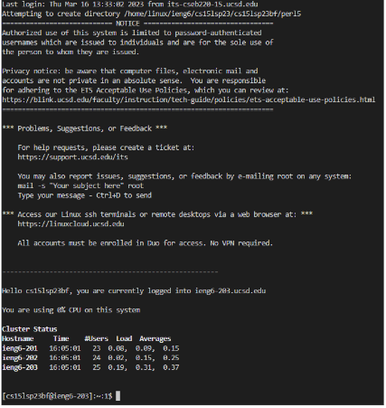
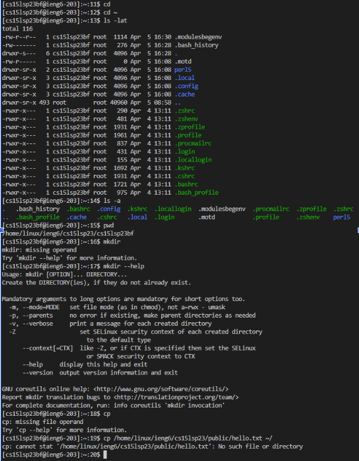

**Lab Report 1**
# Steps to Log Into A Course-specific Account on ieng6:

## Installing VSCode/Preparation

* To log into a into a course-specific account on ieng6, you must first download Visual Studio Code if you don't already have it. An image is shown below of what you should see after launching it.


* If you're using windows, install git and use git bash in VSCode. It will ask you if you would like to install this once VSCode opens. Click install and follow the instructions it gives you. 

* Make sure to update your course specific password if needed and find your course username. 

This can be done through the link: [Course-specific Account for CSE15L](https://sdacs.ucsd.edu/~icc/index.php). 

---
## Remotely Connecting

* To use ssh, open a new terminal in VSCode by clicking on "Terminal" at the top, and then select "New Terminal."

* Type ```ssh cs15lsp23zz@ieng6.ucsd.edu``` into terminal but update "zz" to the letters in your own course username. Refer back to "Installing VSCode/Preparation" above if you didn't find your username yet. 

* Type "yes" when it asks if you want to connect and press enter. 

* You will be asked to enter your password. As you enter it, you will not be able to see it but it is still there so continue typing your full password. It would be easier to type your password somewhere else and paste it in. 

* Congrats! You are now connected to a computer in the CSE basement. The picture below shows what your terminal should look like when you remotely connect. 



---
## Trying Some Commands

* Now you are free to run some commands on the computer. Commands such as ```cd```, ```ls```, ```pwd```, ```mkdir```, and ```cp``` can be used to do a number of things such as change directories and see what files are located in one. 

*Commands and their Functions:*

  1.   ```cd``` changes the directory
  2.   ```ls``` lists the files
  3.   ```pwd``` prints the working directory
  4.   ```mkdir``` makes a directory

*There are a lot more commands that can be used in terminal. Here are some examples of these being used in the image below:*



---
## Logging Out!

* To log out of the remote server, type exit in terminal and then press enter or use Ctrl-D. Follow these steps again if you'd like to log back in. 
