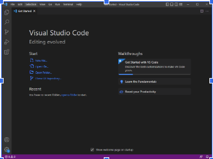

**Lab Report 1**
* To log into a into a course-specific account on ieng6, you must first download Visual Studio Code if you don't already have it. An image is shown below of what you should see after launching it. 

* If you're using windows, install git and use git bash in VSCode. To use ssh, open a new terminal in VSCode by clicking on "Terminal" at the top, and then "New Terminal." Make sure to update your course specific password if needed. Then enter "ssh cs15lsp23zz@ieng6.ucsd.edu" into terminal but update "zz" to the letters in your own course username. Say "yes" when it asks if you want to connect and press enter. You will then be asked to enter your password. As you enter it, you will not be able to see it but it is still there so continue typing your full password. This will then connect you to a computer in the CSE basement. The picture below shows what your terminal should look like when you remotely connect. 

* Now you are free to run some commands on the computer. Commands such as cd, ls, pwd, mkdir, and cp can be used to do a number of things such as change directories and see what files are located in one. cd changes the directory, ls lists the files, pwd prints the working directory, mkdir makes a directory, and there are a lot more commands that can be used in terminal. Here are some examples in the image below. 

* To log out of the remote server, type exit in terminal and then press enter or use Ctrl-D. 
