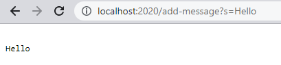
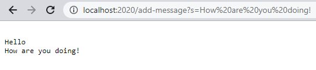

## Part 1

***My code for ```StringServer.java```:***
```
import java.io.IOException;
import java.net.URI;

class Handler implements URLHandler {
    String answer = "";
    public String handleRequest(URI url) {
            System.out.println("Path: " + url.getPath());
            if (url.getPath().contains("/add")) {
                String[] parameters = url.getQuery().split("=");
                answer += "\n" + String.format(parameters[1]);
            }
            return answer;
    }   
}
class StringServer {
    public static void main(String[] args) throws IOException {
        if(args.length == 0){
            System.out.println("Missing port number! Try any number between 1024 to 49151");
            return;
        }

        int port = Integer.parseInt(args[0]);

        Server.start(port, new Handler());
    }
}
```

This is my code for ```StringServer.java```. This checks if the path contains "/add", and when it does, then query gets split into two and assigned to an empty array called parameters. I then told it to return the first index of parameters on a new line.

---

***Using ```/add-message?s=Hello```:***



1. The methods being called here are handleRequest and main. 
2. The argument for handleRequest is URI url. The argument for main is an empty string called args. 

##### Values of relevant fields for Handler class:

- ```String answer = "";``` (An empty string.)

- ```String[] parameters = url.getQuery().split("=");``` (In this case, we'd get a list of length 2. Index 0 would hold the string "-message?s", and index 1 would hold the   <string> we chose which is "Hello".)
    
##### Values of relevant fields for StringServer class:
- ```int port = Integer.parseInt(args[0]);``` (The port number I chose which was 2020, as shown in the URL.)
    
    
3. String answer changes to hold what we wrote for <string> each time we change it. It will no longer be empty after we run the code. In this case it is "Hello". String[] parameters changes as well because the first index will also hold the new "Hello" string. 

    
---

***Using ```/add-message?s=How are you doing!```:***


  
1. The methods being called here are handleRequest and main. 
2. The argument for handleRequest is URI url. The argument for main is an empty string called args. 
    
##### Values of relevant fields for Handler class:
    
-  ```String answer = "";``` (An empty string.)
    
-  ```String[] parameters = url.getQuery().split("=");``` (Index 0 would hold the string "-message?s", and index 1 would hold "How are you doing!")
    
##### Values of relevant fields for StringServer class:
    
-  ```int port = Integer.parseInt(args[0]);``` (2020)
    
    
3. String answer will no longer be empty after we run the code. It changes to hold "How are you doing!". String[] parameters changes as well because the first index will also hold the new "How are you doing!" string that we put in the URL. 
    
---

## Part 2
***Failure-inducing input:***
```
 @Test
  public void testReversed3() {
    int[] input1 = {1, 2, 3};
    assertArrayEquals(new int[]{3, 2, 1}, ArrayExamples.reversed(input1));
  }
 ```
The output:
  
```
    4) testReversed3(ArrayTests)
arrays first differed at element [0]; expected:<3> but was:<0>
        at org.junit.internal.ComparisonCriteria.arrayEquals(ComparisonCriteria.java:78)
        at org.junit.internal.ComparisonCriteria.arrayEquals(ComparisonCriteria.java:28)
        at org.junit.Assert.internalArrayEquals(Assert.java:534)
        at org.junit.Assert.assertArrayEquals(Assert.java:418)
        at org.junit.Assert.assertArrayEquals(Assert.java:429)
        at ArrayTests.testReversed3(ArrayTests.java:38)
        ... 32 trimmed
Caused by: java.lang.AssertionError: expected:<3> but was:<0>
        at org.junit.Assert.fail(Assert.java:89)
        at org.junit.Assert.failNotEquals(Assert.java:835)
        at org.junit.Assert.assertEquals(Assert.java:120)
        at org.junit.Assert.assertEquals(Assert.java:146)
        at org.junit.internal.ExactComparisonCriteria.assertElementsEqual(ExactComparisonCriteria.java:8)
        at org.junit.internal.ComparisonCriteria.arrayEquals(ComparisonCriteria.java:76)
        ... 38 more

FAILURES!!!
Tests run: 10,  Failures: 4
```
  
***Input that doesn’t induce a failure:***
```
@Test
  public void testReversed() {
    int[] input1 = { };
    assertArrayEquals(new int[]{ }, ArrayExamples.reversed(input1));
  }
```
The output: Passed test so no error in output. 

---
### BEFORE:
```
static int[] reversed(int[] arr) {
    int[] newArray = new int[arr.length];
    for(int i = 0; i < arr.length; i += 1) {
      arr[i] = newArray[arr.length - i - 1];
    }
    return arr;
  }
 ```
  
### AFTER:
```
static int[] reversed(int[] arr) {
    int[] newArray = new int[arr.length];
    for(int i = 0; i < arr.length; i += 1) {
      newArray[i] = arr[arr.length - i - 1];
    }
    return newArray;
  }
```
***How I fixed the code:***
To fix the method reversed, I switched arr and newArray with each other so it would look like this: newArray[i] = arr[arr.length - i - 1]. Then instead of returning array, we return newArray since we changed the code to update it. The problem with the original code is that it tried to take values from newArray instead of arr to reverse. The values in arr are the ones we want to reverse and newArray is there for the purpose of storing the reversed values. 
  
## Part 3

Something new that I learned these past two labs was that we could create a whole page/webserver through terminal. We've only used terminal for tests so far in my classes so it was really interesting how it could create a web server as well. I also didn't think we could do math or show strings on the page just by modifying the URL. This was very cool!
