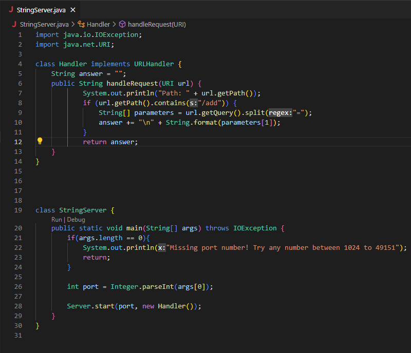

## Part 1

***My code for ```StringServer.java```:***



This is my code for ```StringServer.java```. This checks if the path contains "/add", and when it does, then query gets split into two and assigned to an empty array called parameters. I then told it to return the first index of parameters on a new line.

---

***Using ```/add-message?s=Hello```:***


1. The methods being called here are handleRequest and main. 
2. The argument for handleRequest is URI url. The argument for main is an empty string called args. 

*Values of relevant fields for Handler class:*
* String answer = ""; (An empty string.)
* String[] parameters = url.getQuery().split("="); (In this case, we'd get a list of length 2. Index 0 would hold the string "-message?s", and index 1 would hold the   <string> we chose which is "Hello".)

 *Values of relevant fields for StringServer class:*
 * int port = Integer.parseInt(args[0]); (The port number I chose which was 2020, as shown in the URL.)
3. String answer changes to hold what we wrote for <string> each time we change it. It will no longer be empty after we run the code. In this case it is "Hello". String[] parameters changes as well because the first index will also hold the new "Hello" string. 
---

***Using ```/add-message?s=How are you doing!```:***


  
1. The methods being called here are handleRequest and main. 
2. The argument for handleRequest is URI url. The argument for main is an empty string called args. 

*Values of relevant fields for Handler class:*
* String answer = ""; (An empty string.)
* String[] parameters = url.getQuery().split("="); (Index 0 would hold the string "-message?s", and index 1 would hold "How are you doing!")

 *Values of relevant fields for StringServer class:*
 * int port = Integer.parseInt(args[0]); (2020)
3. String answer will no longer be empty after we run the code. It changes to hold "How are you doing!". String[] parameters changes as well because the first index will also hold the new "How are you doing!" string that we put in the URL. 

---

## Part 2


## Part 3

Something new that I learned these past two labs was that we could create a whole page/webserver through terminal. We've only used terminal for tests so far in my classes so it was really interesting how it could create a web server as well. I also didn't think we could do math or show strings on the page just by modifying the URL. This was very cool!
