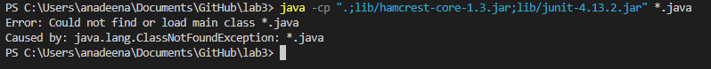

# Part 1 – Debugging Scenario

## Original Student Post :

**What environment are you using (computer, operating system, web browser, terminal/editor, and so on)?**

Terminal on VS Code Windows PC

**Detail the symptom you're seeing. Be specific; include both what you're seeing and what you expected to see instead. Screenshots are great, copy-pasted terminal output is also great. Avoid saying “it doesn't work”.**

I'm having trouble compiling and running ArrayTests. 



**Detail the failure-inducing input and context. That might mean any or all of the command you're running, a test case, command-line arguments, working directory, even the last few commands you ran. Do your best to provide as much context as you can.**

I wanted to run this class with JUnit but it is resulting in this class not found exception. The image above shows the command I wrote to compile and run the tests. 

## TA Response :

I recommend you look back at the commands we use to compile and run with JUnit. There should be two separate commands. You seem to have used the command ```java``` instead of ```javac``` to compile your code.

# Part 2 - Reflection

In the second half of the quarter, I learned about bash scripts which I've never heard of before. i think its very convenient that we can add many comands on a script and run them all at once. It can make things like
grading assignments much faster. It was very confusing at first but now it makes a lot more sense. I will definitely be using this more in the future. 


