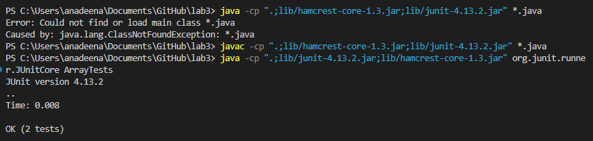
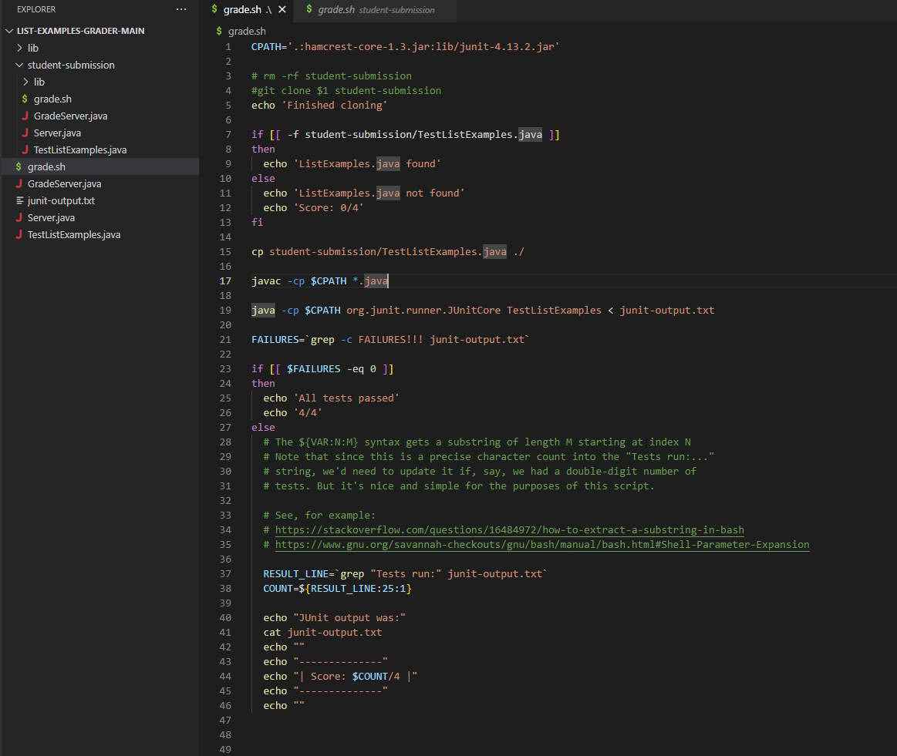
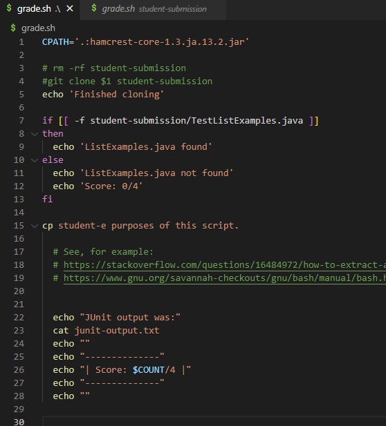

# Part 1 – Debugging Scenario

## Original Student Post :

**What environment are you using (computer, operating system, web browser, terminal/editor, and so on)?**

Terminal on VS Code Windows PC

**Detail the symptom you're seeing. Be specific; include both what you're seeing and what you expected to see instead. Screenshots are great, copy-pasted terminal output is also great. Avoid saying “it doesn't work”.**

I'm having trouble compiling and running ArrayTests. 


**Detail the failure-inducing input and context. That might mean any or all of the command you're running, a test case, command-line arguments, working directory, even the last few commands you ran. Do your best to provide as much context as you can.**

I wanted to run this class with JUnit but it is resulting in this class not found exception. The image above shows the command I wrote to compile and run the tests. 

## TA Response :

I recommend you look back at the commands we use to compile and run with JUnit. There should be two separate commands. You seem to have used the command ```java``` instead of ```javac``` to compile your code.

## Result of feedback : 



The correct commands were used to compile and run the JUnit tests. First ```javac``` was used to compile the code, and then ```java``` is used to run the tests. Not compiling first results in it not being able to find the class required to run the tests. 

## Bash Script : 

I made changes to this bash script to create many errors:




The changes I made are commenting out lines 3 and 4 to prevent it from removing student-submission and cloning the first command line argument. I changed ListExamples.java to TestListExamples.java. Then I changed the output redirection sign to flip the other way. The last thing I did was remove "fi" at the end of the last if statement which is required to close it. 

When I changed these in the bash script, it resulted in this very long error:

```
anadeena@DESKTOP-J6VTTQV MINGW64 ~/Desktop/CSE8B/list-examples-grader-main
$ bash grade.sh https://github.com/ucsd-cse15l-f22/list-examples-grader.git
Finished cloning
ListExamples.java found
TestListExamples.java:1: error: package org.junit does not exist
import static org.junit.Assert.*;
                       ^
TestListExamples.java:6: error: cannot find symbol
class IsMoon implements StringChecker {
                        ^
  symbol: class StringChecker
TestListExamples.java:2: error: package org.junit does not exist
import org.junit.*;
^
TestListExamples.java:13: error: cannot find symbol
  @Test(timeout = 500)
   ^
  symbol:   class Test
  location: class TestListExamples
TestListExamples.java:22: error: cannot find symbol
  @Test(timeout = 500)
   ^
  symbol:   class Test
  location: class TestListExamples
TestListExamples.java:31: error: cannot find symbol
  @Test(timeout = 500)
   ^
  symbol:   class Test
  location: class TestListExamples
TestListExamples.java:39: error: cannot find symbol
  @Test(timeout = 500)
   ^
  symbol:   class Test
  location: class TestListExamples
TestListExamples.java:17: error: cannot find symbol
    List<String> merged = ListExamples.merge(left, right);
                          ^
  symbol:   variable ListExamples
  location: class TestListExamples
TestListExamples.java:19: error: cannot find symbol
    assertEquals(expected, merged);
    ^
  symbol:   method assertEquals(List<String>,List<String>)
  location: class TestListExamples
TestListExamples.java:26: error: cannot find symbol
    List<String> merged = ListExamples.merge(left, right);
                          ^
  symbol:   variable ListExamples
  location: class TestListExamples
TestListExamples.java:28: error: cannot find symbol
    assertEquals(expected, merged);
    ^
  symbol:   method assertEquals(List<String>,List<String>)
  location: class TestListExamples
TestListExamples.java:35: error: cannot find symbol
    List<String> filtered = ListExamples.filter(input, new IsMoon());
                            ^
  symbol:   variable ListExamples
  location: class TestListExamples
TestListExamples.java:36: error: cannot find symbol
    assertEquals(expect, filtered);
    ^
  symbol:   method assertEquals(List<String>,List<String>)
  location: class TestListExamples
TestListExamples.java:43: error: cannot find symbol
    List<String> filtered = ListExamples.filter(input, new IsMoon());
                            ^
  symbol:   variable ListExamples
  location: class TestListExamples
TestListExamples.java:44: error: cannot find symbol
    assertEquals(expect, filtered);
    ^
  symbol:   method assertEquals(List<String>,List<String>)
  location: class TestListExamples
15 errors
Error: Could not find or load main class org.junit.runner.JUnitCore
Caused by: java.lang.ClassNotFoundException: org.junit.runner.JUnitCore
grade.sh: line 49: syntax error: unexpected end of file
```

I then deleted a huge chunk of code randomly and it looked like this:



The output was:

```
anadeena@DESKTOP-J6VTTQV MINGW64 ~/Desktop/CSE8B/list-examples-grader-main
$ bash grade.sh https://github.com/ucsd-cse15l-f22/list-examples-grader.git
Finished cloning
ListExamples.java found
cp: target 'script.' is not a directory
JUnit output was:

--------------
| Score: /4 |
--------------
```
This is a unique output from what I've seen before because it's trying to find script. which is not a directory. Also it still somehow managed to clone it even though I commented out the git clone command.

# Part 2 - Reflection

In the second half of the quarter, I learned about bash scripts which I've never heard of before. i think its very convenient that we can add many comands on a script and run them all at once. It can make things like
grading assignments much faster. It was very confusing at first but now it makes a lot more sense. I will definitely be using this more in the future. 


